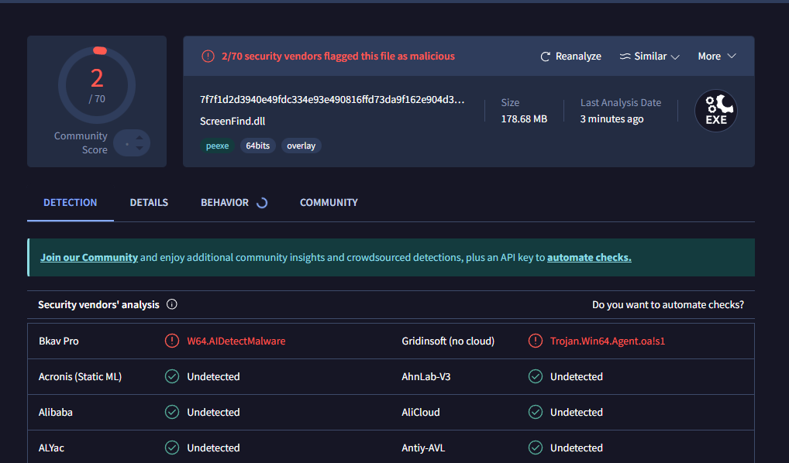
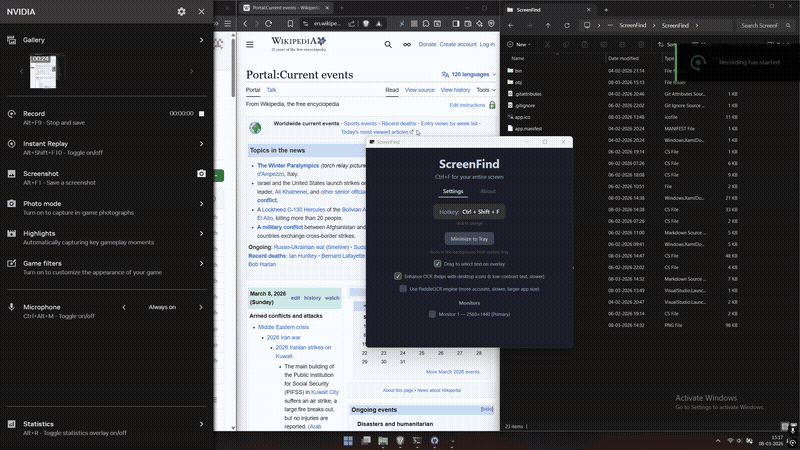

# ScreenFind — Ctrl+F for Your Entire Screen

A lightweight Windows tool that lets you search for any text visible on your screen using OCR.
Press a hotkey anywhere, type your search, see matches highlighted live on screen.

Uses the **built-in Windows 10/11 OCR engine** — no cloud APIs, no dependencies, runs 100% locally.

---

## Download

**[Download ScreenFind.exe (v1.4.0)](https://github.com/sid1552/ScreenFind/releases/latest)**

Standalone exe — just download and double-click. No installation or .NET runtime needed.

VirusTotal scan results

[View full report on VirusTotal](https://www.virustotal.com/gui/file/102811242c2d3aa7306e210c40fc88e3907199a3a157c811724477a292f7b7de/detection)

0/67 — no security vendors flagged this file. Source code is fully open and auditable.

---

## How It Works

1. Press your hotkey (default **Ctrl + Shift + F**) from anywhere
2. Your screen freezes (screenshot taken) and dims
3. A Spotlight-style search bar appears
4. Start typing — exact matches highlighted in **yellow**, fuzzy matches in **blue**
5. Press **Enter** to jump to the next match, **Shift+Enter** for previous
6. Press **Ctrl+C** to copy the current match text
7. **Click** any match highlight to copy its text
8. **Drag** anywhere to select and copy text (like selecting in a PDF)
9. Press **Escape** to dismiss

---

## Features

- **Real-time search** — matches highlighted as you type
- **Fuzzy matching** — catches OCR misreads (e.g. "rn" read as "m"), shown in blue
- **Click-to-copy** — click any match highlight to copy its text
- **Drag-to-select** — lasso any text on screen, auto-copied to clipboard (toggleable)

- **Customizable hotkey** — click the hotkey display in the main window to record a new one
- **Dark / Light mode** — Catppuccin Mocha (dark) and Catppuccin Latte (light) themes
- **High contrast mode** — extra-readable variant for both dark and light themes
- **Auto-start with Windows** — launches minimized to system tray on login (no admin needed)
- **Enhanced OCR mode** — optional image preprocessing for low-contrast text and desktop icons
- **System tray** — minimize to tray, runs silently in background
- **Multi-monitor support** — captures all monitors simultaneously, each gets its own overlay
- **Grouped settings UI** — clean card-based layout with Hotkey, General, Overlay, and Monitors sections
- **Settings persistence** — preferences saved to `%AppData%\ScreenFind\settings.json`

---

## Keyboard Shortcuts

| Key              | Action                    |
|------------------|---------------------------|
| Ctrl + Shift + F | Open screen search (default, customizable) |
| (type)           | Search in real time       |
| Enter            | Jump to next match        |
| Shift + Enter    | Jump to previous match    |
| F3 / Shift+F3    | Next / previous match     |
| Ctrl + C         | Copy current match text   |
| Click match      | Copy that match's text    |
| Drag             | Select and copy text      |
| Escape           | Close the overlay         |

---

## Changing the Hotkey

Click the hotkey display in the main window, press your desired key combo, done. The new hotkey is saved automatically.

Requires at least one modifier (Ctrl, Alt, Shift, or Win) plus a key.

---

## Requirements

- **Windows 10** (build 19041 / version 2004) or later, or **Windows 11**
- An OCR language pack installed (English is included by default)

---

## Troubleshooting

**"Could not register hotkey"**
Another app is using that shortcut. Click the hotkey display to choose a different one.

**OCR returns no results / "No OCR language pack"**
Go to **Windows Settings > Time & Language > Language** and make sure you have a language installed with the **Basic typing** option.

**Highlights are offset / wrong position**
This can happen with unusual DPI setups. Multi-monitor is fully supported — each monitor gets its own overlay with independent DPI scaling. If a specific monitor causes issues, you can exclude it in Settings.

---

## Contributing

Contributions are welcome! See [CONTRIBUTING.md](CONTRIBUTING.md) for build instructions, architecture overview, and development details.

---

## License

[MIT License](LICENSE) — free to use, modify, and share.
