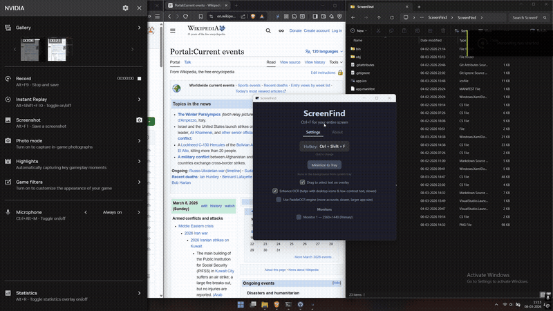

# ScreenFind — Ctrl+F for Your Entire Screen

[](https://buymeacoffee.com/siddharthsqn)

A lightweight Windows tool that lets you search for any text visible on your screen using OCR.
Press a hotkey anywhere → type your search → see matches highlighted live on screen.

Uses the **built-in Windows 10/11 OCR engine** — no Tesseract, no cloud APIs, no dependencies.



---

## Download

**[Download ScreenFind.exe (v1.0.0)](https://github.com/sid1552/ScreenFind/releases/latest)**

Standalone exe — just download and double-click. No installation or .NET runtime needed.

---

## How It Works

1. Press your hotkey (default **Ctrl + Shift + F**) from anywhere
2. Your screen freezes (screenshot taken) and dims
3. A Spotlight-style search bar appears
4. Start typing — exact matches highlighted in **yellow**, fuzzy matches in **blue**
5. Press **Enter** to jump to the next match, **Shift+Enter** for previous
6. Press **Ctrl+C** to copy the current match text
7. **Click** any match highlight to copy its text
8. **Drag** anywhere to select and copy text (like selecting in a PDF)
9. Press **Escape** to dismiss

---

## Features

- **Real-time search** — matches highlighted as you type
- **Fuzzy matching** — catches OCR misreads (e.g. "rn" → "m"), shown in blue
- **Click-to-copy** — click any match highlight to copy its text
- **Drag-to-select** — lasso any text on screen, auto-copied to clipboard (toggleable)
- **Customizable hotkey** — click the hotkey display in the main window to record a new one
- **Enhanced OCR mode** — optional image preprocessing for low-contrast text and desktop icons
- **System tray** — minimize to tray, runs silently in background
- **Settings persistence** — preferences saved to `%AppData%\ScreenFind\settings.json`

---

## Keyboard Shortcuts

| Key              | Action                    |
|------------------|---------------------------|
| Ctrl + Shift + F | Open screen search (default, customizable) |
| (type)           | Search in real time       |
| Enter            | Jump to next match        |
| Shift + Enter    | Jump to previous match    |
| F3 / Shift+F3    | Next / previous match     |
| Ctrl + C         | Copy current match text   |
| Click match      | Copy that match's text    |
| Drag             | Select and copy text      |
| Escape           | Close the overlay         |

---

## Changing the Hotkey

Click the hotkey display in the main window → press your desired key combo → done. The new hotkey is saved automatically.

Requires at least one modifier (Ctrl, Alt, Shift, or Win) plus a key.

---

## Building from Source

### 1. Install .NET 8 SDK

Download from: **https://dotnet.microsoft.com/download/dotnet/8.0**

Verify with:
```
dotnet --version
```

### 2. Clone & Run

```
git clone https://github.com/sid1552/ScreenFind.git
cd ScreenFind
dotnet run
```

### 3. Build Standalone Exe

```
dotnet publish -c Release -r win-x64 --self-contained true -p:PublishSingleFile=true -p:IncludeNativeLibrariesForSelfExtract=true
```

Output: `bin\Release\net8.0-windows10.0.19041.0\win-x64\publish\ScreenFind.exe`

---

## Requirements

- **Windows 10** (build 19041 / version 2004) or later, or **Windows 11**
- An OCR language pack installed (English is included by default)

For building from source: **.NET 8 SDK**

---

## Troubleshooting

**"Could not register hotkey"**
→ Another app is using that shortcut. Click the hotkey display to choose a different one.

**OCR returns no results / "No OCR language pack"**
→ Go to **Windows Settings → Time & Language → Language** → Make sure you have a language installed with the **Basic typing** option.

**Highlights are offset / wrong position**
→ This can happen with unusual DPI setups or multi-monitor configurations. Currently supports the primary monitor at any DPI scale.

---

## Architecture

```
Hotkey pressed
    │
    ├── Screen captured (GDI+ BitBlt)
    │
    ├── Overlay window shown instantly
    │       ├── Frozen screenshot (dimmed)
    │       ├── Search bar (ready for input)
    │       └── Selection canvas (drag-to-select)
    │
    └── OCR runs async (~200-500ms)
            │
            └── Results ready → search + highlight as you type
```

- **Screen capture**: GDI+ `CopyFromScreen` — fast and reliable
- **OCR**: `Windows.Media.Ocr.OcrEngine` — built into Windows, returns word-level bounding boxes
- **Image preprocessing**: Optional grayscale + contrast boost for difficult text
- **Overlay**: WPF borderless topmost window with canvas-drawn highlights
- **DPI**: Fully handled — works at 100%, 125%, 150%, 200% scaling
- **Settings**: JSON config in `%AppData%\ScreenFind\settings.json`

---

## License

Free to use, modify, and share. No attribution required.
